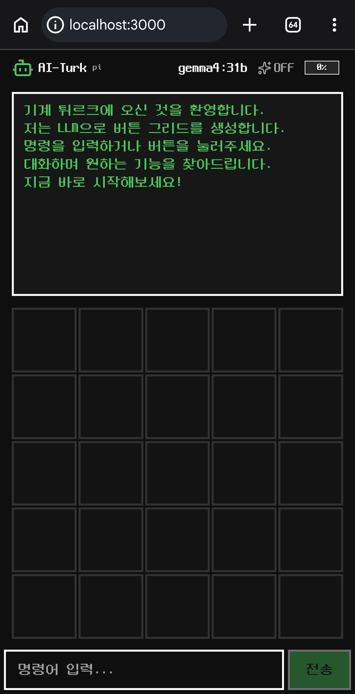

# 🤖 AI Turk



기계 튀르크에 오신 것을 환영합니다.
저는 LLM으로 버튼 그리드를 생성합니다.
명령을 입력하거나 버튼을 눌러주세요.
대화하며 원하는 기능을 찾아드립니다.
지금 바로 시작해보세요!

## 소개


18세기 체스 기계 "터키인"에는 안에 사람이 숨어 있었습니다.
AI Turk도 같은 원리 — 기계 안에 **LLM이 숨어** 버튼 그리드를 생성합니다.

**AI Turk**는 코딩 에이전트 전용 인터페이스입니다.
백엔드를 추상화하여 **pi**(`pi --mode rpc`) 와 **Claude Code**(`claude -p stream-json`) 양쪽을 지원합니다.
세션 컨텍스트 자동 관리, 도구 사용(bash, read, edit), 실시간 스트리밍을 지원합니다.

Claude Code 백엔드는 Anthropic API(순수 Claude) 또는 [Ollama](https://ollama.com)의
Anthropic 호환 엔드포인트(`ollama launch claude --model <m>` 동등) 양쪽으로 구동 가능 — `.env` 설정으로 선택.

## 구동 방법

pi 에이전트에게 `/start` 명령으로 시작하세요.

```
git clone https://github.com/sng2c/ai-turk.git
cd ai-turk
pi /start
```

에이전트가 의존성 설치, 서버 실행, 상태 확인을 자동으로 수행합니다.

### 수동 구동

```bash
git clone https://github.com/sng2c/ai-turk.git
cd ai-turk
npm install
turkctl start
```

접속: `http://127.0.0.1:3000`

### 백엔드 전환 (pi ↔ Claude Code)

`.env`의 `TURK_BACKEND`로 백엔드를 선택합니다. 기본은 `pi`.

| 값 | 백엔드 | 설명 |
|---|---|---|
| `pi` | `pi --mode rpc` | 로컬 pi CLI (기본) |
| `claude` | `claude -p stream-json` | Anthropic Messages API 호환 엔드포인트 |

#### Claude Code 백엔드

`TURK_BACKEND=claude`는 `ANTHROPIC_BASE_URL`이 가리키는 엔드포인트로 Anthropic Messages API 요청을 보냅니다. 두 구성을 지원합니다:

**① 순수 Anthropic Claude (권장)** — Anthropic API 키로 직접 사용
```bash
TURK_BACKEND=claude
TURK_CLAUDE_MODEL=sonnet          # opus/sonnet/haiku 또는 claude-* 전체 이름
ANTHROPIC_API_KEY=sk-ant-...        # 또는 ANTHROPIC_AUTH_TOKEN
# ANTHROPIC_BASE_URL 비우면 기본 api.anthropic.com 사용
```

**② Ollama Claude** — Ollama 0.14+ 의 Anthropic 호환 엔드포인트 (`ollama launch claude --model <m>` 동등)
```bash
TURK_BACKEND=claude
TURK_CLAUDE_MODEL=glm-5.1:cloud    # Ollama에 pull 된 모델
ANTHROPIC_BASE_URL=http://localhost:11434
ANTHROPIC_AUTH_TOKEN=ollama         # 임의값 (비어두면 subscription 폴백)
```
필요 시 Ollama 준비: `ollama serve` + `ollama pull glm-5.1:cloud`.

> 전환 후 `turkctl restart` (또는 `.env` 변경 시 자동 재시작).
> 타이틀 옆에 백엔드 종류(`pi`/`claude`)가 작게 표시됩니다.
> 전체 변수는 [`.env.example`](.env.example) 참고.

## 스스로 수정 가능

AI Turk의 핵심은 **pi 에이전트가 스스로 코드를 수정**할 수 있다는 점입니다.

1. `turkctl start`로 서버를 실행합니다.
2. pi 에이전트가 `src/` 코드를 수정합니다.
3. Vite HMR이 변경사항을 **즉시 브라우저에 반영**합니다 — 재시작 불필요.
4. 에이전트는 결과를 실시간으로 확인하고 추가 수정할 수 있습니다.

## 더 보기

- [위키: AI Turk 프로젝트](https://wiki.app.gslump.com/pages/ai-turk)
- [위키: 기계 튀르크 아이디어](https://wiki.app.gslump.com/pages/아이디어/기계터키인)
- [GitHub 저장소](https://github.com/sng2c/ai-turk) (branch: `node-react`)
