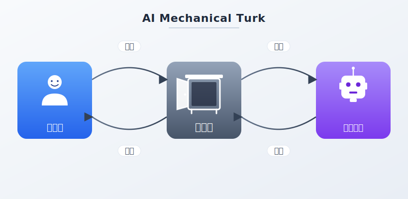

# 🤖 AI Turk



기계 튀르크에 오신 것을 환영합니다.
저는 LLM으로 버튼 그리드를 생성합니다.
명령을 입력하거나 버튼을 눌러주세요.
대화하며 원하는 기능을 찾아드립니다.
지금 바로 시작해보세요!

## 소개


18세기 체스 기계 "터키인"에는 안에 사람이 숨어 있었습니다.
AI Turk도 같은 원리 — 기계 안에 **LLM이 숨어** 버튼 그리드를 생성합니다.

**AI Turk**는 LLM이 실시간으로 동적 버튼 그리드를 생성하는 인터페이스입니다.
사용자가 명령을 입력하거나 버튼을 클릭하면, `pi` 코딩 에이전트가 응답을 생성하고
새로운 버튼 그리드를 제안합니다. 대화를 통해 원하는 기능을 탐색할 수 있습니다.

### 특징

- **pi 에이전트 전용** — `pi --mode rpc`를 영구 백엔드로 사용
  - 세션 컨텍스트 자동 관리 (pi가 대화 히스토리 유지)
  - 도구 사용 지원 (bash, read, edit 등)
  - 실시간 스트리밍 (`text_delta` 이벤트)
  - 자동 재시도 / 컨텍스트 컴팩션 내장
- **HMR 자동 반영** — 코드 수정 시 서버 재시작 없이 즉시 화면에 적용
  - 에이전트가 코드를 고치면 브라우저에 실시간 반영
  - 빌드 없이 개발 가능
- **픽셀 아트 UI** — Neo둥근모 폰트 + Pixelact UI 스타일
- **단일 프로세스** — Vite + pi RPC + WebSocket이 하나의 서버에서 실행

## 구동 방법

### 시작

```bash
turkctl start
```

`http://127.0.0.1:3000`에서 접속 가능합니다.

### 제어 명령

```
turkctl start     # 서버 시작
turkctl stop      # 서버 종료
turkctl restart   # 서버 재시작
turkctl status    # 실행 상태 확인
turkctl logs      # 실시간 로그
turkctl session   # 현재 세션 정보
turkctl ws        # WebSocket 연결 테스트
turkctl pi        # pi 프로세스 상태
turkctl build     # 프로덕션 빌드
```

> 항상 `turkctl`로 구동 제어. 직접 `npm run dev`나 `pkill` 사용 금지.

## 스스로 수정 가능

AI Turk는 **pi 에이전트가 스스로 코드를 수정**할 수 있도록 설계되었습니다.

1. `turkctl start`로 서버를 실행합니다.
2. pi 에이전트가 `src/` 코드를 수정합니다.
3. Vite HMR이 변경사항을 **즉시 브라우저에 반영**합니다.
4. 에이전트는 결과를 실시간으로 확인하고 추가 수정할 수 있습니다.

`vite.config.ts`나 `.env`를 변경한 경우에만 `turkctl restart`가 필요합니다.
그 외 모든 코드 수정은 재시작 없이 자동 반영됩니다.

## 아키텍처

```
브라우저 (React) ←WebSocket→ Vite 서버 ←stdin/stdout→ pi --mode rpc
                                   ↑
                            .env에서 모델/API 설정
```

| 구성 | 기술 |
|---|---|
| 프론트엔드 | React 19 + TypeScript + Vite 8 |
| 스타일 | Tailwind v4 + Pixelact UI + Neo둥근모 |
| 백엔드 | Node.js + ws (WebSocket) |
| LLM | pi --mode rpc (JSONL 프로토콜) |
| 제어 | turkctl (bash 스크립트) |

## 설정

`.env` 파일에서 모델과 포트를 설정합니다:

```bash
PORT=3000
TURK_RPC_BIN=pi
TURK_RPC_MODEL=ollama-cloud/gemini-3-flash-preview
TURK_RPC_ARGS=
```

## 라이선스

MIT